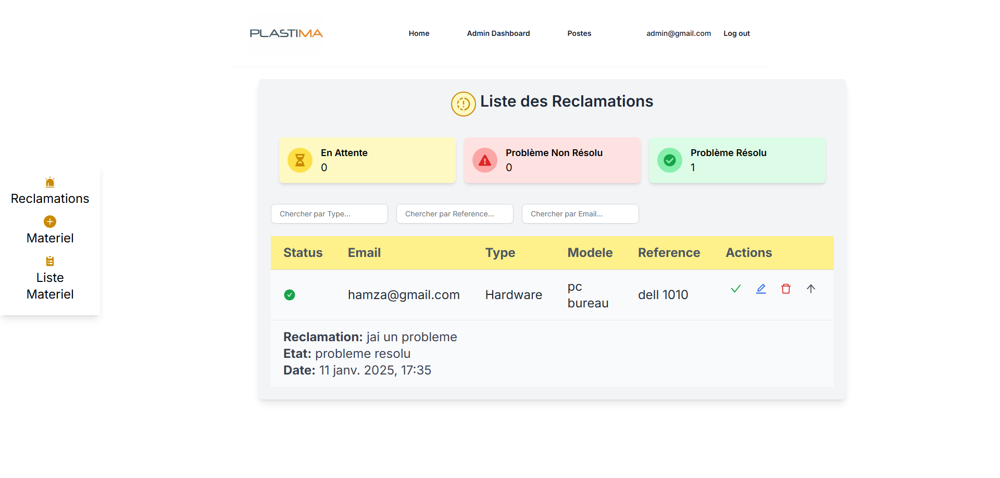

<a id="readme-top"></a>

<!-- PROJECT LOGO -->
<br />
<div align="center">
 

  <h3 align="center">ResolveTrack</h3>

  <p align="center">
    A Complaint Management System dedicated to providing efficient and transparent solutions for managing claims.
  </p>
</div>

<!-- TABLE OF CONTENTS -->
<details>
  <summary>Table of Contents</summary>
  <ol>
    <li>
      <a href="#about-the-project">About The Project</a>
      <ul>
        <li><a href="#built-with">Built With</a></li>
      </ul>
    </li>
    <li><a href="#screenshots">Screenshots</a></li>
    <li>
      <a href="#getting-started">Getting Started</a>
      <ul>
        <li><a href="#prerequisites">Prerequisites</a></li>
        <li><a href="#installation">Installation</a></li>
      </ul>
    </li>
    <li><a href="#contact">Contact</a></li>
  </ol>
</details>

<!-- ABOUT THE PROJECT -->
## About The Project

<a href="https://github.com/Hamza-Alali-0/ResolveTrack">
    
</a>

ResolveTrack is an innovative platform designed to streamline the management of employee and customer complaints. Built with modern web technologies, it offers a seamless and efficient solution for receiving, tracking, and resolving complaints in real-time.

Here's why ResolveTrack stands out:
- **Efficient Complaint Management**: Simplifies the process of receiving, categorizing, and resolving complaints.
- **Real-Time Updates**: Provides real-time status updates for all complaints, ensuring transparency and accountability.
- **Centralized Dashboard**: Offers a centralized dashboard for easy tracking and management of complaints.
- **Enhanced User Experience**: Improves the experience for both employees and customers by reducing resolution times and increasing transparency.

ResolveTrack aims to revolutionize complaint management by providing tools like automated categorization, real-time updates, and actionable insights, ensuring faster resolution times and improved operational efficiency.

### Built With

This project is built with the following technologies:

* [![Next.js][Next.js.com]][Next.js-url]
* [![React][React.com]][React-url]
* [![Node.js][Node.js.com]][Node.js-url]
* [![Express][Express.com]][Express-url]
* [![MongoDB][MongoDB.com]][MongoDB-url]

<!-- Reference-style links for images -->
[Next.js.com]: https://img.shields.io/badge/Next.js-000000?style=for-the-badge&logo=next.js&logoColor=white
[Next.js-url]: https://nextjs.org/
[React.com]: https://img.shields.io/badge/React-61DAFB?style=for-the-badge&logo=react&logoColor=black
[React-url]: https://reactjs.org/
[Node.js.com]: https://img.shields.io/badge/Node.js-339933?style=for-the-badge&logo=node.js&logoColor=white
[Node.js-url]: https://nodejs.org/
[Express.com]: https://img.shields.io/badge/Express-000000?style=for-the-badge&logo=express&logoColor=white
[Express-url]: https://expressjs.com/
[MongoDB.com]: https://img.shields.io/badge/MongoDB-47A248?style=for-the-badge&logo=mongodb&logoColor=white
[MongoDB-url]: https://www.mongodb.com/

<p align="right">(<a href="#readme-top">back to top</a>)</p>

<!-- SCREENSHOTS -->
## Screenshots

Here are some screenshots of the project:

| ![Login Page][Login-screenshot] | ![Complaint Page][Complaint-screenshot] | ![Workstation Page][Workstation-screenshot] |
|-------------------------------|----------------------------------|----------------------------------|
| **Login Page**                 | **Complaint Page**                  | **Workstation Page**                  |

<!-- Reference-style links for images -->
[Login-screenshot]: Assets/login.png
[Complaint-screenshot]: Assets/reclamer.png
[Workstation-screenshot]: Assets/postes.png

<p align="right">(<a href="#readme-top">back to top</a>)</p>


<!-- GETTING STARTED -->
## Getting Started

To get a local copy up and running, follow these steps.

### Prerequisites

Before you begin, ensure you have the following installed:
- Node.js (version 16 or higher)
- MongoDB (version 5.0 or higher)
- A modern web browser (e.g., Chrome, Firefox)

### Installation

1. **Clone the repository**
   ```sh
   git clone https://github.com/Hamza-Alali-0/ResolveTrack.git

2. **Install Dependencies**
   ```sh
   npm install

3. **Replace your Database URI**

 MONGO_URI='your-URI-'

4. **Start the Server**
   ```sh
   npm run dev


<a id="contact"></a>
## Contact

Hamza Alali - [hamza.alali.dev@gmail.com](mailto:hamza.alali.dev@gmail.com)


Connect with me:
- <a href="https://dev.to/@hamzaalali0" target="_blank"></a>
- <a href="https://www.linkedin.com/in/hamza--alali" target="_blank"></a>
- <a href="https://github.com/hamza-alali-0" target="_blank"></a>
- <a href="https://www.instagram.com/alalihamza.0/" target="_blank"></a>

Project Link: [https://github.com/Hamza-Alali-0/Resolvetrack](https://github.com/Hamza-Alali-0/Resolvetrack)

<p align="right">(<a href="#readme-top">back to top</a>)</p>
   
